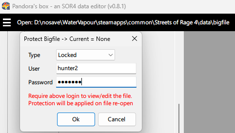
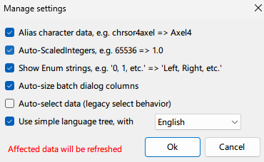

# Project information

This page contains information about

* Planned developments of **Pandora's box**, and its current capabilites.
* Known limitations of the editor and game engine are also documented here.
* Other noteworthy findings that were discovered about the bigfile

### Contents

- [Project information](#project-information)
    - [Contents](#contents)
  - [Release strategy](#release-strategy)
  - [Roadmap](#roadmap)
  - [Current capabilities](#current-capabilities)
    - [General](#general)
    - [Bigfile related](#bigfile-related)
    - [Data tree related](#data-tree-related)
    - [Configuration tree related](#configuration-tree-related)
    - [Misc](#misc)
  - [Known limitations](#known-limitations)
    - [Editor](#editor)
    - [Game engine](#game-engine)
  - [Interesting behaviors](#interesting-behaviors)

## Release strategy

**Pandora's box** official releases will be published to [GameBanana](https://gamebanana.com/tools/18927) and [NexusMods](https://www.nexusmods.com/streetsofrage4/mods/174). Optionally, you can also get a copy from this repository's [release page](https://github.com/fuzzyetdeadly/sor4-pandoras-box/releases/latest).

**Nightly builds** will be available to anyone who wishes to participate in our **open beta**. If you are interested to participate, please join us at [Discord](https://discord.gg/UzrMtCD7y9) and say "Hi", and let me know your intention, so that I may assign you a role to see the **modders corner** group in the server.


## Roadmap

The following developments are planned for future versions, but it will be an indefinite amount of time before they become available. They aren't in any particular order of priority. These are left vague on purpose, as they are high level ideas.

* Miscellenous usability improvements (ongoing)
* More responsive UI (currently some things don't update instantly)
* Chaos generator (requested by MoonLightFox)
* *And more...*

## Current capabilities

### General

* **Multi-instancing**  
  Multiple copies of *Pandora's box* can be run in parallel. The value of this is explained [here](../general/getting-started.md#use-multi-instancing)
* **(Steam only) (Re)run game**  
  When you begin modding the bigfile, you'll quickly realize that you'll need to restart the game **A LOT**. This feature allows you to do so in one click (or hotkey). It works with the [modify from anywhere](#bigfile-related) feature.
* **Lazy loading**  
  Pandora's box practices **lazy loading** of *data* and *configuration* trees. Meaning, nodes are only added to the trees on demand. This allows the tool to load quicker, by reducing redundant computations/visualization of information that isn't interesting to the user.

### Bigfile related

* **Modifies most data**  
  Most of the data in the bigfile can be modified. There are a few that are intentionally hidden, because they shouldn't be modded, or don't offer meaningful modding options.

* **(Steam only) Modify from anywhere**    
  You can copy a bigfile into your `My Documents` folder and edit it from there. When you save and [(Re)-run](#general) the game, the tool will create a backup of your game's bigfile, then hot-swap the file you are working on with it and start the game.  
  The value of this is that you don't risk corrupting your game's original bigfile.

* **File protection**  
  Bigfiles can be locked as **read-only** or with a **user/password** combination. These locks may will only come into effect the next time you attempt to open your *bigfile*. As long as you don't close your file, you will have the option to disable the lock after adding it. After closing the file, the *read-only* lock is **permanent**, while the latter may still be removed if the correct credentials are provided. The primary use-case for this is to allow authors to protect their work from theft.

  

* **Support for older bigfile versions**  
  *Pandora's box* allows you to port data between new and old versions of the *bigfile* (see [here](#data-tree-related)). However, due to differences in the [data structure](../technical/data-structures.md) of different game versions; this poses a risk of crashes when running the game, and also while using the tool.
  
  If you wish to port data between versions, you should verify the integrity of data after porting them to ensure they are structurally similar with that of the target version. Don't forget to also back your work up (preferably using [Git](../general/getting-started.md#use-git)), just in case something goes wrong.

### Data tree related

Data trees represent all the [data chunks](../technical/data-structures.md#data-chunk) found within a *bigfile*.

* **Select**  
  Select data using `space` or `left double click`. This will display all configurations within the data at the right-side panel.

* **Duplicate, Rename, Discard**  
  Any data can be duplicated and renamed. Duplication will require a unique name to be supplied before it is allowed to be confirmed. The **path** of the data name you choose will determine where it is nested in the data tree. 

  

  In the example above, the data will be located at `characters/sor4_playables/chrsor4blaze`

  

  Note that data names must adhere to a **regex pattern**. These are used in quite a few places within *Pandora's box* to prevent bad inputs. For the above example, it is:
  
  ```powershell
  ^characters\/sor[1-4]_(enemies|playables)(\/[\-\w]+)+$
  ```
  I recommend copy and pasting this to [regex101.com](https://regex101.com/), for an explanation of what it does (too technical to explain for this document).

* **Copy to/from file**  
  When working with [multi-instancing](#general), the option to copy a data block to a temporary file, then back into another open *bigfile* is available. This is useful when developing new content for your mod in a sacrificial file, which can easily be ported back to your main one later. It is also useful for porting examples from other open-source bigfiles into your project for use.

### Configuration tree related

Configuration trees represent all the [data structures](../technical/data-structures.md#data-type-structures) containing configurations, which are unpacked from *data chunks*. Please read the [terminology](../technical/data-structures.md#terminology) before you continue. Without them, some concepts will be difficult to explain for this section.

* **Standard configuration operations**  
  There are a variety of operations you may perform on the data structures within this tree, and there are also restrictions for use cases that don't make sense.
  
  The operations expected to be most common are **Copy**, **Cut**, **Paste**, **Edit**, **Delete**.
  
  **Add** is available, but is exclusive to empty *collections*. It is also allowed to **Duplicate** fields within a *collection*. Both these operations are needed for collections, which don't allow *paste* (technical limitation)
  
  Last but not least, **Sort** is available when working with `LevelData` `Timeline` groups (which are mostly in a messed up sequence).

 Restrictions are not explained in detail here. They should be quite obvious by inspecting the context menu for different nodes within the configuration tree.

### Misc

* **Settings**  
  The following settings allow you to customize the look and feel of *Pandora's box*  
    
  They are mostly self-explanatory with examples.

   Auto-select data is intended to be deprecated in future. It is recommended not to enable it (to avoid getting used to it)
* **User friendly language editing**   
  The *simple language tree* setting presents a more minimal configuration tree for `Localization` data. Without it, you will normally see every language displayed in the tree, which is challenging to navigate.
  
  
  Additionally, a dialog allowing you to rotate between languages (for quicker editing) is also available, with or without *simple language tree* enabled.
* **Definition management**  
  **Pandora's box** uses a definition management system to recognize the purpose of configurable *fields* within every [data structure](../technical/data-structures.md), by identifying their **type**. This will affect how the edit interface for a *field* is presented to users.
  

   Most of the commonly used fields are already defined as part of the *Pandora's box* artifact. If there are any unknowns, kindly report it to our [Discord](https://discord.gg/UzrMtCD7y9), so that it may be investigated and updated for a future version of the tool.

## Known limitations

Please take note of the following known limitations before placing a request for new features, thanks.

### Editor

These are limitations that the creators of Pandora's box do not have the knowledge or capacity to build. It also includes things that were decided not to work on, mostly on the grounds that the effort to build it doesn't justify the value generated.

* Adding custom sounds to the game's `*.bnk` files.  
  While exploring the **bigfile**, no useful information could be found about how the game identifies sounds with meaningful names in the `*.bnk` files of the game's `data` directory.  
  There is a [Sound replacer](https://gamebanana.com/tools/7816) tool, but I suspect this is only able to replace existing sounds, and not add new ones.
* For the configuration tree, many operations aren't supported for *collections*. 
  This is a trade-off for a cleaner visualization of the configuration tree. The alternative would be a mess of folders for collections.

### Game engine

These are things that were discovered during development to not be possible to achieve without changes to the game's source code.

* Creating new inputs (i.e. new button mappings) into the game
* Configuring input priority  
  There are certain conditions where the game will prioritize certain inputs over others.  
  For example, configure a `move` (**A**) with input `➡️➡️ + Special` for a character that can run. If you run and try to do a move with input `➡️ + Special` (**B**), you're always going to get *A*, unless you release the input and press it again.
* Configuring moves other than defensive special to cancel out of hitstun
* Modifying the juggle protection time limit (yes, there actually is one)
* Creating custom menu items in the game menus.  
  The look and feel can be adjusted, but the menu items (e.g. Stage, Arcade, Training, etc.) cannot be changed
* Creating custom texture packs and getting the game to recognize them.  
  Sadly, this is not possible. Therefore, to add custom textures, the core game texture files require modification. The impact of this is that it makes it harder to create mods that utilize custom textures.
* Customizing the game's music tracks  
  The games background music in general seems to be a combination of a lot of cut-up sounds working together. There are hundreds to thousands of sounds in the game, and no evidence could be found in the bigfile of how the game decides which sounds to *"stitch together"*.

## Interesting behaviors

This section contains information about noteworthy surprises found within the bigfile

* The game supports multiple **"stances"** for characters. These are used for characters such as Murphy to control their ability to access different moves (e.g. armor, other moves, etc.) when they switch stances. Note that if armor/stamina is configured, it will be the same for every stance above the original.
* It is possible to have more than one `move` switched using the move selection. Every `move` has a configuration allowing you to bind it to one of the character select options, and another to configure the `alt move`. By assigning these inputs, you can have sets of moves to switch with character move selection!