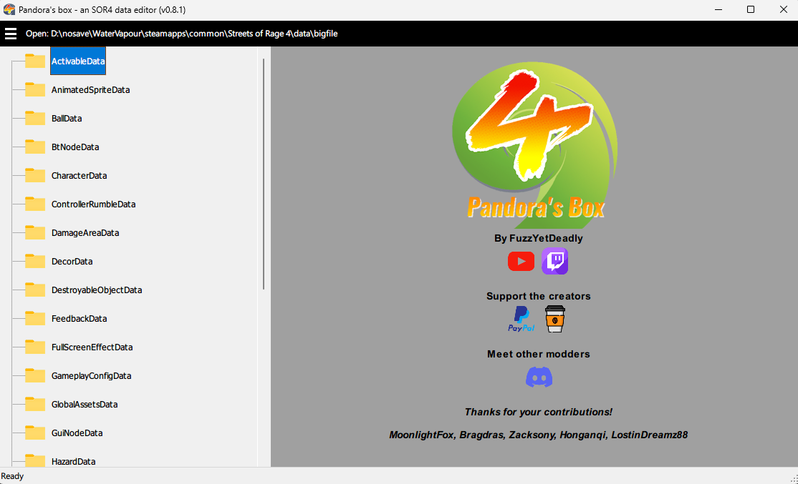

# Getting started

This page provides information on the requirements to mod with **Pandora's box**, and basic instructions on how to begin modding. It assumes own the **Steam** version of the game.

### Contents

* [Requirements](#requirements)
* [Bigfile modding](#bigfile-modding)
* [Modding recommendations](#modding-recommendations)

## Requirements

### Must haves

* A copy of *Pandora's box* from [GameBanana]() or [NexusMods]()
* **Windows 10** or newer  
(Unfortunately, I don't know how to configure the code compiler to work for Mac and Linux, and have no plans to learn how as it would cost me extra maintenance. Sorry!)
* **.NET 8.0** runtime.  
When you try to run the application's executable, you will be prompted to install this if you don't already have it on your machine
* Patience  
The game's data configurations can get VERY confusing. It will take trial and error to understand how stuff works, and create your desired customizations.

### Should haves

* A copy of **Streets of Rage 4** (SOR4), preferably on ***Steam*** to benefit from the tool's [(Re)run game](../functional/project-information.md#general) feature.  
 If you don't have the game on *Steam*, it should still work for *Epic games store* and *GoG versions*. The main difference is that you'll need to re-start your game each time after saving changes to your bigfile. You also won't be able to benefit from the [mod anywhere](../functional/project-information.md#bigfile-related) feature.

## Bigfile modding

**Streets of Rage 4** (SOR4) is a heavily **data-driven** game. Many of the things you encounter in the game are configured in the game's **bigfile**. This should be at `<steam_installation_path>\steamapps\common\Streets of Rage 4\data\bigfile`.

 If you own a copy of the game with Epic games or GoG, you'll need to Google to find out where the bigfile is located.

Below is an example that demonstrates a very simple modification to get you comfortable.

1\. Launch Pandora's box, then open your *bigfile*. The tool will remember your choice until it is changed.

2\. The following start view will be presented

The left panel contains the list of data types within the *bigfile*, while the right contains a link to this documentation, and other links of interest.

3\. Use the `arrow keys` or `left double click` to navigate the **data**, and once you've found one of interest, select it with `space` or `left double click`. The configurations within the data will be loaded and presented at the right panel.

You will see **folders** and **sheets** here. Each *folder* represents a configuration **group**. *Sheets* are **fields** you can edit to change the games configuration.

*Groups* will often contain nested *groups*, and also *fields* that are relevant to them. The names of *groups* are intended to be self-documenting, and to make it more obvious what the purposes of their contents are.

 Groups are a human readible representation of the *bigfile's* [data structures](../technical/data-structures.md).

4\. As a simple example, lets make Stage 1 take you straight to the boss fight. Navigate into the folder structure until you see the following.

`Delete` the first two sections, then save your *bigfile*.

 Deleting *groups*/*fields* does not result in data loss, you can use `insert` to restore them as long as you don't close the tool.

5\. Run the game, and attempt to play Stage 1. You sould now be taken directly to the boss.

That's it, you've created your first mod!

## Modding recommendations

### Use Git

If you plan to create a heavily customized mod, I strongly recommend learning to use **Git** to manage versions of your modded *bigfiles* for the following reasons:

* It is **VERY** easy to make changes to a configuration, and forget that you made it.
* **Git** will make it obvious to you the file contains changes which you may have forgotten about.
* If you made a configuration that cause unexpected results, you can easily roll back
* If a bad configuration was made, leading to the famous `Smells like burnt chicken` error, you can easily roll back.
* You won't have to create tens to hundreds of backup files, which can get confusing very fast.

### Use multi-instancing

*Pandora's box* is multi-instanceable. This means you can launch two copies of it at once. The value of this is as follows:

1\. You make some changes to your file and wish to temporarily delete some data (e.g. delete sections of a stage to be able to test stuff quicker in later sections), and restore it later.

2\. Open a second instance of the editor, and make the temporary deletions there. The first instance will preserve the state of your file before the deletions were made.

3\. Once you've verified things work as expected, re-save with your first instance, and the temporary deleted data will be restored. The second instance can be closed once you no longer need to verify temporary scenarios.

 Another value of multi-instancing is to open other bigfiles as a reference while modding your own. This can be very useful during the learning process when it isn't obvious how to achieve certain effects.

### Save often

Better to be safe than sorry