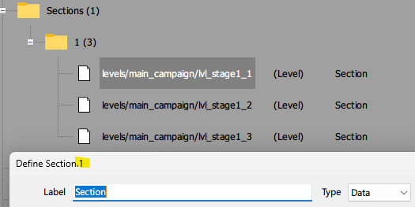

# Data structures

## Bigfile contents

Each **Streets of Rage 4** (SOR4) *bigfile* is a massive concatenation of *data chunks*. Bigfiles for different versions of the game are structurally different. This is the reason why *bigfiles* from one version of the game will crash when you attempt to use it with another.

## Data chunk

Each of these represents a huge collection of configurations for various **data sets**. They are read by SOR4 on load, and control a lot of aspects of the game.

Interesting ones include

* MetaGameConfig
* Localization
* Character
* BtNode
* AnimatedSprite
* Sprite
* Pickup
* Projectile
* Level
* Decor
* SurvivalConfig

See [here](#data-set-structures) for details.

### Terminology

The *data structures* within each *data set* is extremely complex. The following terminology will be used to describe them.

* **Group**: each *data set* will unpack into many **data groups**. *Groups* can contain other nested *groups*. They will often also contain *fields*.
* **Fields** are configurable variables that may be owned by *data sets* or *groups*.
* **Collection**: these are a special *group* that contains only *fields* with duplicate *identifiers* (ID). For example, stage sections (has an ID of `*.1`).
  
* **Identifiers**: are *Pandora's box's* means of differentiating the meanings of the absolute mess of variables within each *data set*.
* **Group list**: an array of *groups*. When you see a *group*, you can expect it's always going to be within a *group list*. In the image above, the folder `Sections (1)` is a *group list*, while the folder `1 (3)` is a section group/collection. Unfortunately, this is necessary complexity to visualize the data within the bigfile, to ensure similar *groups* don't get muddled with one another.

## Data types

Every *field* has a data type. This section provides details on the data types you can expect to work with in the *bigfile*.

## Data set structures

This section provides and overview of the *data structures* of various *data sets* (with focus on the more interesting ones). They represent how *data groups* relate to one another. 

## Authors note

This section is very technical in nature, and will be gradually expanded at my leisure when I have time to do so.