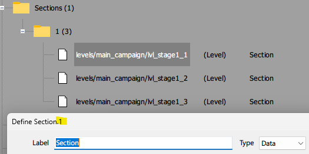

# Data structures

## Bigfile contents

Each **Streets of Rage 4** (SOR4) *bigfile* is a massive concatenation of *data chunks*. Bigfiles for different versions of the game are structurally different. This is the reason why *bigfiles* from one version of the game will crash when you attempt to use it with another.

## Data chunk

Each of these represents a huge collection of configurations for various **data types**. They are read by *SOR4* and *Absolum* on load, and control a lot of aspects of the game.

Interesting ones include

* MetaGameConfig
* Localization
* Character
* BtNode
* AnimatedSprite
* Sprite
* Pickup
* Projectile
* Level
* Decor
* SurvivalConfig

See [here](#data-type-structures) for details.

### Terminology

The *data structures* within each *data type* is extremely complex. The following terminology will be used to describe them.

* **Group**: each *data type* will unpack into many **field groups**. *Groups* can contain other nested *groups*. They will often also contain *fields*.
* **Fields** are configurable variables that may be owned by *data types* or *groups*.
* **Collection**: these are a special *group* that contains only *fields* with duplicate *identifiers* (ID). For example, stage sections (has an ID of `*.1`).
  
* **Identifiers**: are *Pandora's box's* means of differentiating the meanings of the absolute mess of variables within each *data set*. They can have definitions configured to give them meaning.
* **Group list**: an array of *groups*. When you see a *group*, you can expect it's always going to be within a *group list*. In the image above, the folder `Sections (1)` is a *group list*, while the folder `1 (3)` is a section group/collection. Unfortunately, this is necessary complexity to visualize the data within the bigfile, to ensure similar *groups* don't get muddled with one another.

## Field types

Every *field* has a **type**. These are the various *field types* you can expect to work with in the *bigfile*. They can be found directly within data and field groups. Unused types are intentionally ommitted.

| Name      | Description |
|-----------|-------------|
| Varint    | Undefined Protobuf varint. May be `Boolean` or `Int` |
| Boolean   | True or False  |
| Int       | Signed integer |
| ScaledInt | Signed scaled integer = (Int / 65536) to get a floating point number |
| Enum      | Preset control options |
| Float32   | Floating point number |
| String    | Mostly descriptions or `WWise` audio/music references |
| Text      | Multi-line strings, used only for `Localization` data |
| Data      | Reference to other data in the `bigfile` |
| Texture   | Reference to a texture loaded by the [texture manager](../functional/project-information.md#texture-manager-related) |

## Data type structures

This section provides overviews of the *data structures* of various *data types* (with focus on the more interesting ones). These overviews intend to make clearer how *data types* and *groups* relate to one another.

## Authors note

This section is very technical in nature, and will be gradually expanded at my leisure when I have time to do so.